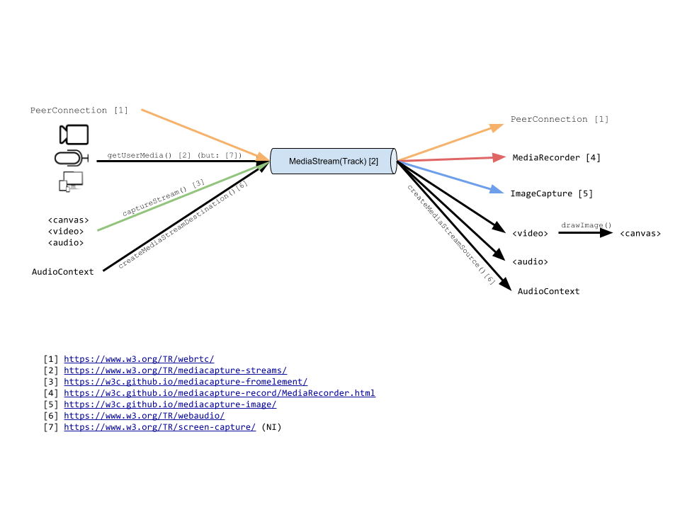

# Streams-MediaStreamTrack API Specification

This is the repository for `stream-mediastreamtrack`, an experimental API for generating [`Streams`](https://streams.spec.whatwg.org/#stream) out of a [`MediaStreamTrack`](https://www.w3.org/TR/mediacapture-streams/#mediastreamtrack).

You're welcome to contribute! Let's make the Web rock our socks off!

## Introduction

[`Streams`](https://streams.spec.whatwg.org/#stream) are designed to provide real time streams of data with powerful semantics (e.g. built-in backpressure and queuing) to allow users to build higher-level abstractions.

[`MediaStreamTracks`](https://www.w3.org/TR/mediacapture-streams/#mediastreamtrack) are opaque handles to Real-Time video or audio being transported in the browser. This media is produced or consumed via Sources and Sinks offered by the platform and represented in the following diagram:



Users' options when a given functionality is not readily available varies. The capabilities for Audio processing are quite developed thanks to the WebAudio bridge and its [ScriptProcessorNode](https://developer.mozilla.org/en/docs/Web/API/ScriptProcessorNode) that essentially enables what this Spec is looking for.

For Video, however, unsupported source/sink functionality forces users to resort to contortions such as reflexion on intermediate HTML elements (e.g. `<canvas>`, see [the Workarounds Section](#current-related-efforts-and-workarounds)) or offline processing (e.g. using [`MediaRecorder`](https://w3c.github.io/mediacapture-record/MediaRecorder.html)).  These approaches, however, lose the timing information, introduce friction in the interoperability between elements and need unnecesary processing steps.

This situation is made only more evident with the arrival of powerful programmable environments such as [WebAssembly](http://webassembly.org/) where users will naturally expect to be able to manipulate Real-Time media.

## Use cases

Use cases that depend explicitly on timing are enabled, e.g.:

- Measuring the amount of Video Frames produced; calculating the source frame rate.
- Calculating inter-frame measures, e.g. motion flow, presence/absence, stabilization,
- Adding subtitles to Video/Audio.

Whereas use cases that do not depend explicitly on timing are not enabled but are enhanced:

- Producing per-frame analysis and transformations and the endless array of digital image processing algorithms, e.g. edge enhancement or chrome keying.
- Adjusting the presentation timestamp of the media to speed up or slow down video, hence creating a timelapse or slow-motion effect.

### Possible future use cases ?

Making a `MediaStreamTrack` both a `ReadableStream` and a `WritableStream` (i.e. a `TransformStream`) would allow for even more sophisticated use cases where users could 'plug' custom elements in `MediaStreamTrack`-based pipelines, e.g. WebAssembly operations between WebCam capture and Recording, etc.

## Current Related Efforts and Workarounds

The most usual hack to access Video data is to cast a given `MediaStreamTrack` onto a `<video>` element and onto a `<canvas>` in turn that is subsequently read back -- `<video>` elements provide no `drawed` event so it's up to the user to blit from `<video>` to `<canvas>` on a timely basis (see e.g. [this article](https://developer.mozilla.org/en-US/docs/Web/API/Canvas_API/Manipulating_video_using_canvas#Manipulating_the_video_frame_data)).  Moreover, usually reading from `<canvas>` implies a costly read back from GPU and potential pixel conversions needed.

Chrome [Pepper API](https://developer.chrome.com/native-client/pepper_dev) introduced and supports both [MediaStreamVideoTrack](https://developer.chrome.com/native-client/pepper_dev/cpp/classpp_1_1_media_stream_video_track) and [MediaStreamAudioTrack](https://developer.chrome.com/native-client/pepper_dev/cpp/classpp_1_1_media_stream_audio_track) addressing a similar situation as the one described here.

As mentioned before, WebAudio [ScriptProcessorNode](https://developer.mozilla.org/en/docs/Web/API/ScriptProcessorNode) (or successor) enables similar use cases for Audio.

## Examples and demos

http://rawgit.com/yellowdoge/streams-mediastreamtrack/master/index.html#examples

## Notes on bikeshedding :bicyclist:

To compile, run:

```
curl https://api.csswg.org/bikeshed/ -F file=@index.bs -F force=1 > index.html
```

if the produced file has a strange size (i.e. zero), then something went terribly wrong; run instead

```
curl https://api.csswg.org/bikeshed/ -F file=@index.bs -F output=err
```
and try to figure out why `bikeshed` did not like the `.bs` :'(
